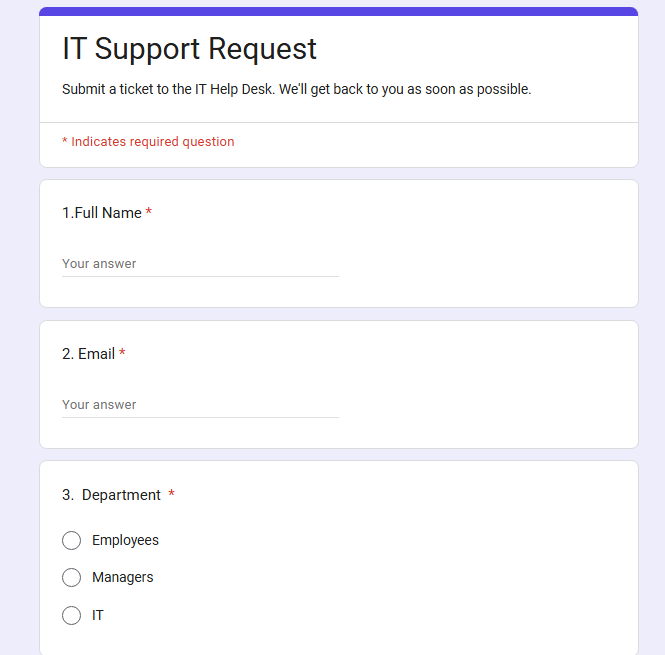
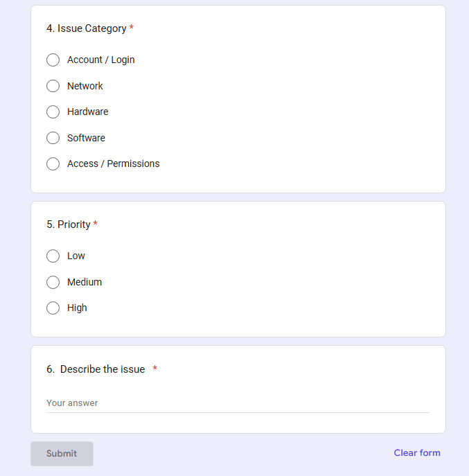
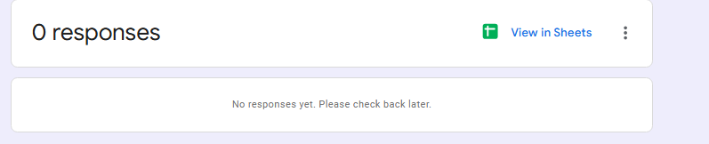
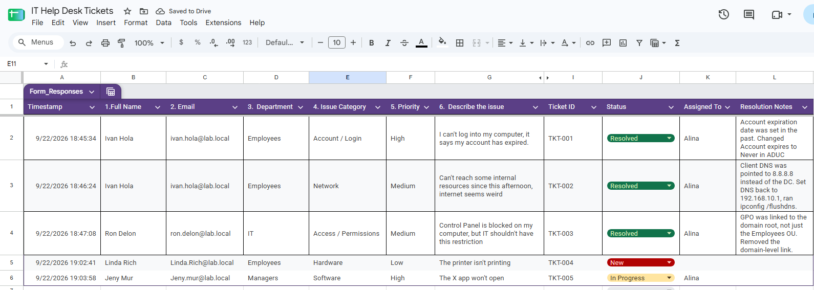
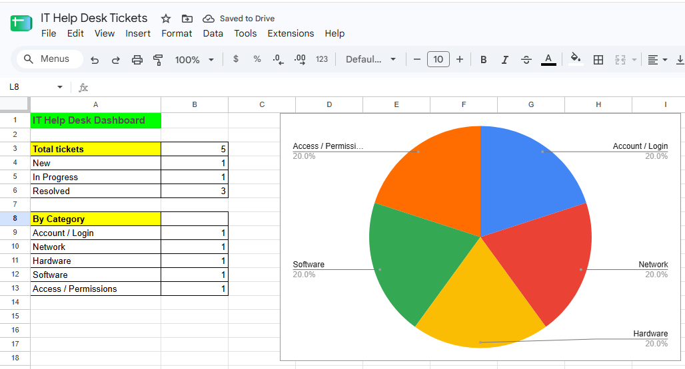
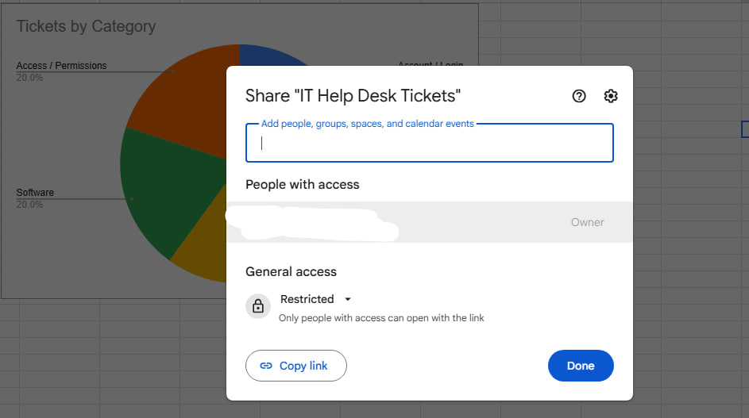
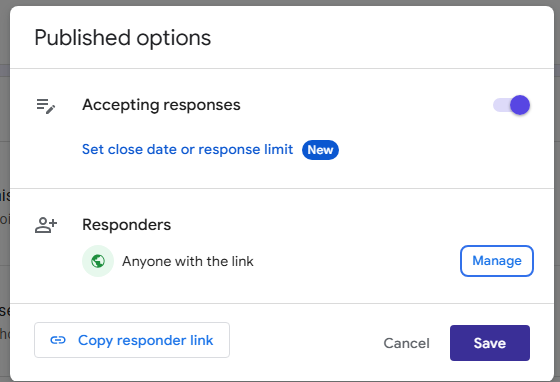

# Google Workspace Help Desk

A small ticketing system built entirely out of Google Workspace tools — Forms for intake,
Sheets for tracking, a dashboard for reporting, and Drive for access control. No paid
software, no admin console, just the apps most companies already have.

This connects to the rest of the repo: the tickets logged here are the same three I worked
in the [troubleshooting-tickets](../troubleshooting-tickets) lab, plus two open ones, so
the whole thing reads like one small IT department's workload rather than separate
exercises.

## Intake: the request form

Built a Google Form that employees would use to submit a ticket — name, email, department,
issue category, priority, and a description.




Two things I got wrong the first time and fixed:

- Priority was set up as checkboxes, which meant someone could mark a ticket Low, Medium
  and High at once. Switched it to single-choice.
- Forgot the description field entirely. A ticket with no description is basically
  useless to whoever picks it up.

## The Submit button that wouldn't work

Linked the form to a new spreadsheet, went to submit the first test ticket, and the
Submit button just stayed greyed out.



The spreadsheet was linked fine — the problem was that newer versions of Google Forms
treat a form as a draft until it's explicitly published. There used to be an "Accepting
responses" toggle for this; now it lives behind a Publish button. Published it, opened the
actual responder link instead of the preview, and submissions went through.

## Tracking: the ticket sheet

Every submission lands in the sheet automatically. On top of the form's columns I added
the ones a help desk tech actually works in: Ticket ID, Status (a dropdown — New / In
Progress / Resolved, color-coded), Assigned To, and Resolution Notes.



TKT-001 through 003 are resolved, with notes pulled from the real fixes in the
troubleshooting lab. TKT-004 is new and still unassigned; TKT-005 is in progress.

Some cleanup along the way:

- One description came through as a URL instead of text (pasted the wrong thing).
  Clearing it didn't remove the hyperlink formatting — had to delete the cell and retype.
- The form had been collecting the submitter's Google account email in an extra column.
  Turned that off in the form settings and hid the leftover column, since it duplicated
  the Email field and would have exposed my personal address in screenshots.

## Reporting: the dashboard

A separate sheet with live counts, built with `COUNTA` and `COUNTIF` against the ticket
sheet, plus a chart of tickets by category. New submissions update it automatically — no
manual counting.



```
Total tickets   =COUNTA('Form Responses 1'!I2:I)
New             =COUNTIF('Form Responses 1'!J:J,"New")
By category     =COUNTIF('Form Responses 1'!E:E,A9)
```

## Access control

This was the part I actually cared most about getting right. The two files need opposite
settings:

- **The ticket sheet** has names, emails, and descriptions of people's problems. It's set
  to **Restricted** — only people explicitly added can open it, even if someone gets
  hold of the link.



- **The form** needs to be reachable by anyone who has a problem, so responders are set
  to **Anyone with the link**. Submitting a ticket doesn't give access to anyone else's
  tickets.



Least privilege in its simplest form: people get exactly the access their role needs.
Both files live together in one shared Drive folder so the whole help desk is in one place.

## What I'd add next

- An Apps Script that emails the submitter a confirmation with their ticket ID, so the
  ID doesn't have to be typed in by hand.
- A "Date Resolved" column, to track how long tickets stay open.
- In a real organization, this would run on a Workspace domain with sharing limited to
  the company — on a personal account the closest equivalent is Restricted.

Tools: Google Forms, Google Sheets (dropdowns, COUNTIF, charts), Google Drive sharing.
