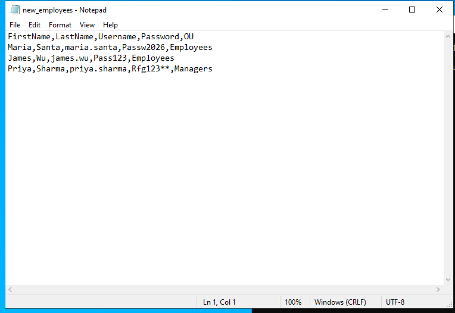
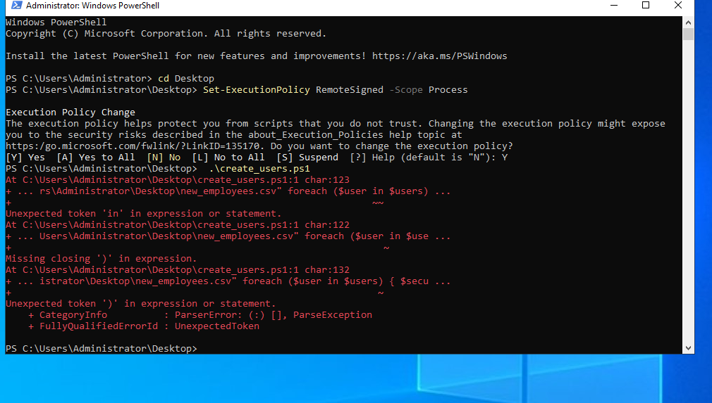
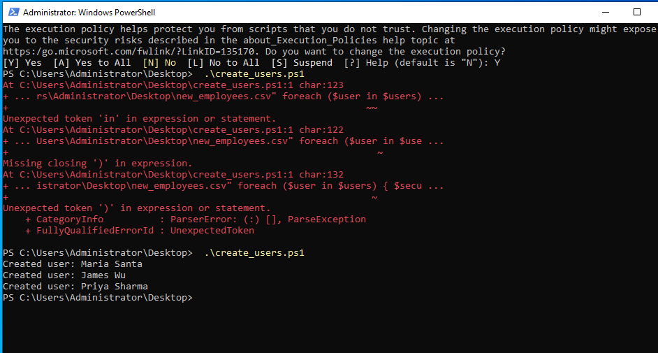
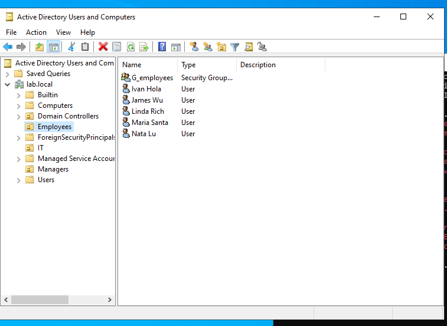
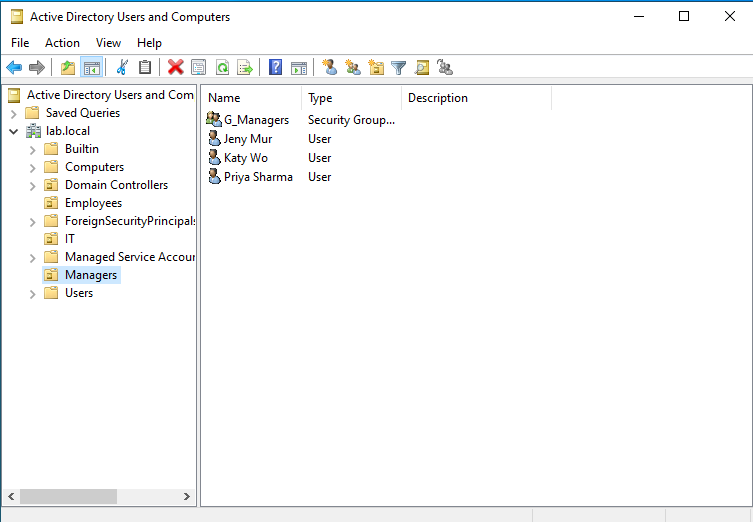

# PowerShell Automation — Bulk User Creation

Another add-on to the [Active Directory home lab](../active-directory-lab). After doing
enough manual user creation through ADUC, I wanted to try the thing every AD tutorial
mentions but rarely walks through properly — creating multiple users at once from a CSV
file with a script instead of clicking through the New User wizard for each one.

This one had more friction than I expected, and honestly the debugging was the more
useful part of the exercise.

## The idea

A CSV file with new employee info, and a PowerShell script that reads it and creates a
matching AD account for each row — right name, right username, right OU, right starting
password.

```
FirstName,LastName,Username,Password,OU
Maria,Santa,maria.santa,Passw2026,Employees
James,Wu,james.wu,Pass123,Employees
Priya,Sharma,priya.sharma,Rfg123**,Managers
```



(Yes, `Pass123` is a weak password — left it in on purpose to see if AD's complexity
policy would actually reject it. It didn't, which was a small surprise. Windows Server's
default complexity requirement wants 3 of 4 categories — upper, lower, number, symbol —
and `Pass123` technically clears that bar even though it's not a password I'd actually
want on anything.)

## First attempt: not great

Wrote the script using backtick line continuation (the standard way to split a long
PowerShell command across multiple lines for readability), copied it from my notes,
pasted it into Notepad on the VM, saved it, ran it.

```
.\create_users.ps1
```



Wall of red text. `Unexpected token 'in'`, `Missing closing ')'`, all pointing at line 1
of a script that was clearly more than one line when I wrote it. Took a second to
realize what happened — copying through the VirtualBox clipboard bridge had flattened
the whole script onto a single physical line, and backtick line-continuation depends on
the backtick being immediately followed by an actual newline. No newline, no
continuation, and the parser has no idea what it's looking at anymore.

(Side note, unrelated but happened right before this: clipboard sharing between my host
machine and the VM didn't work at all until I installed VirtualBox Guest Additions on
DC01. If you're setting this up from scratch and copy/paste into the VM just does
nothing, that's probably why.)

## Fix: stop depending on line breaks

Rewrote the script without backtick continuation at all — used a hashtable with
`New-ADUser @params` (splatting) instead of a long parameter chain, and added semicolons
after every statement. That way it parses correctly whether it lands as multiple lines
or gets squashed into one, since semicolons do the separating instead of line breaks.

```powershell
Import-Module ActiveDirectory;
$users = Import-Csv -Path "C:\Users\Administrator\Desktop\new_employees.csv";
foreach ($user in $users) {
$securePassword = ConvertTo-SecureString $user.Password -AsPlainText -Force;
$upn = "$($user.Username)@lab.local";
$ouPath = "OU=$($user.OU),DC=lab,DC=local";
$params = @{ Name = "$($user.FirstName) $($user.LastName)"; GivenName = $user.FirstName; Surname = $user.LastName; SamAccountName = $user.Username; UserPrincipalName = $upn; Path = $ouPath; AccountPassword = $securePassword; Enabled = $true; ChangePasswordAtLogon = $true };
New-ADUser @params;
Write-Host "Created user: $($user.FirstName) $($user.LastName)";
}
```

(Full file: [create_users.ps1](create_users.ps1))

Ran it again:



```
Created user: Maria Santa
Created user: James Wu
Created user: Priya Sharma
```

All three in one command. Went into ADUC to double check they actually landed in the
right OUs and not just somewhere generic:





Employees OU got Maria and James, Managers OU got Priya — matches the CSV.

## What this was actually for

`New-ADUser` one at a time isn't hard, but it doesn't scale — onboarding five new hires
by hand through a GUI wizard five separate times is exactly the kind of repetitive task
that should be a script instead. This is a small version of that: point the script at a
CSV, get every account created and placed correctly in one run.

Things I'd change if I were doing this for an actual environment rather than a lab:

- Passwords shouldn't sit in a plaintext CSV — for anything real I'd generate random
  temp passwords in the script itself, or prompt for them, rather than storing them in a
  file.
- No error handling right now — if one row in the CSV is malformed or a user already
  exists, I'm not sure yet whether it stops the whole loop or just fails that one row
  silently. Worth testing deliberately at some point.
- Would add a check for existing accounts before trying to create (`Get-ADUser` first)
  so re-running the script twice doesn't throw errors on duplicates.

Environment: Windows Server 2022 (DC01), PowerShell 5.1, Active Directory module. Domain
setup is in [active-directory-lab](../active-directory-lab).
