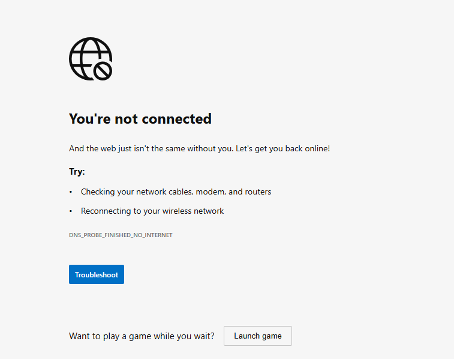
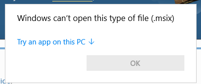
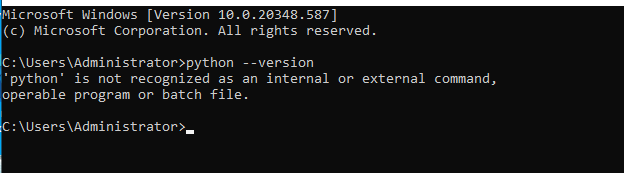
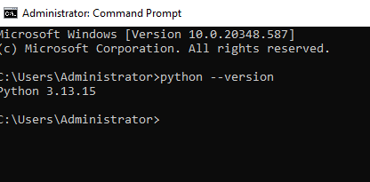
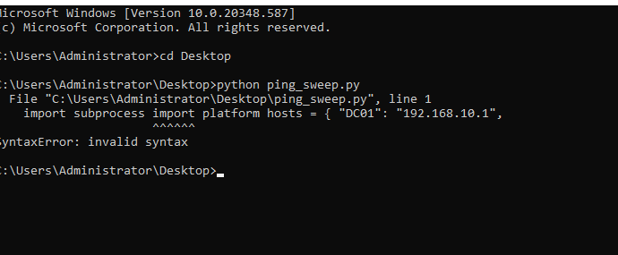
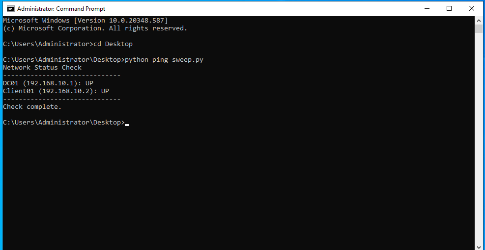

# Python Network Check

Fourth add-on to the [Active Directory home lab](../active-directory-lab). After the
[PowerShell automation](../powershell-automation) one, I wanted to try something similar
in Python instead — mostly to see how much of the same friction would show up again, and
whether the earlier fixes would actually apply here too.

Short version: yes, a lot of the same friction showed up again, in slightly different
shapes. Long version below.

## The idea

Nothing fancy — a script that pings a short list of hosts (DC01, Client01) and prints
whether each one is reachable. The kind of thing that's genuinely useful as a first check
when something on the network seems off, before diving into any of the deeper
troubleshooting from the [tickets lab](../troubleshooting-tickets).

## Getting Python onto DC01 in the first place

Tried to download Python from python.org inside the DC01 VM and got this:



Forgot, for a second, that DC01's only network adapter is set to VirtualBox's Internal
Network — which is deliberately isolated, no route out to the actual internet. That's
correct for the domain to work, but it also means no downloading anything from inside
that VM as-is.

Fix: added a second network adapter to the VM, set to NAT this time, and left the
original one alone. Now DC01 has one adapter for the domain (still static IP,
192.168.10.1) and a second one just for internet access. Didn't have to touch anything
inside Windows — the second adapter picked up its own IP automatically.

## Wrong installer

With internet working, downloaded what I thought was the Python installer and got:



Windows can't open `.msix` files directly like a normal installer — that's the packaging
format tied to the Microsoft Store, not the standalone installer. Went back to
python.org and specifically grabbed the "Windows installer (64-bit)" link instead of
whatever the page had defaulted me toward.

## Installed, but still not found

```
python --version
'python' is not recognized as an internal or external command,
operable program or batch file.
```



Installed fine this time, but forgot to check "Add python.exe to PATH" during setup —
without that, Windows has no idea `python` is a command you can just type. Uninstalled,
ran the same installer again, paid attention to that checkbox this time, and it worked:



## Same clipboard problem as before, different language

Wrote the script, pasted it in, ran it:

```
python ping_sweep.py
  File "C:\Users\Administrator\Desktop\ping_sweep.py", line 1
    import subprocess import platform hosts = { "DC01": "192.168.10.1",
                       ^^^^^^^^
SyntaxError: invalid syntax
```



Recognized this one immediately — it's the exact same clipboard issue from the
PowerShell lab, just showing up as a `SyntaxError` instead of a parser error this time.
Line breaks got flattened again, and since Python uses indentation instead of braces,
losing the line breaks doesn't just look messy, it actually breaks the whole structure of
the script.

Same fix as before, adapted to Python: rewrote it as a single logical line, chaining
statements with semicolons and swapping the `for` loop for a list comprehension so there
was no indented block left to lose. (There's a properly formatted, readable version of
the same script in this folder too —
[ping_sweep_readable.py](ping_sweep_readable.py) — since the one-liner that actually
survives copy-paste is not exactly pleasant to read.)

Ran it again:



```
python ping_sweep.py
Network Status Check
------------------------------
DC01 (192.168.10.1): UP
Client01 (192.168.10.2): UP
------------------------------
Check complete.
```

Both hosts show up as reachable, which matches reality — DC01 and Client01 were both
running at the time.

## Takeaway

The actual script here is genuinely simple, maybe ten minutes of work on its own. Almost
everything documented above was environment problems, not code problems — no internet
access from an isolated VM, the wrong file type, a skipped checkbox, a clipboard eating
line breaks. None of that shows up in a tutorial, but it's most of what actually happens
when you're setting something up for real, and it's the same category of problem I'd
expect to run into constantly doing IT support — the tool itself is rarely the hard part.

Environment: Windows Server 2022 (DC01), Python 3.13, VirtualBox with a second NAT
adapter for internet access. Domain setup is in
[active-directory-lab](../active-directory-lab).
