# Troubleshooting Practice — 3 Help Desk Tickets

This builds on my [Active Directory home lab](../active-directory-lab) — same DC01/Client01
setup, same `lab.local` domain. Once I had the domain, users, and groups working, I wanted
to practice actually troubleshooting problems instead of just building infrastructure that
works on the first try. So I set up three "tickets" for myself: I broke something on purpose
without writing down what, then worked it like a real support request — reproduce, gather
evidence, form a theory, confirm it, fix it, verify.

Below is how each one actually went, including the wrong turns.

---

## Ticket 1 — "Can't log into my computer"

**Reported by:** Ivan Hola (Employees)

I logged into Client01 as Ivan and tried to sign in. Got this:


`The user's account has expired.` Honestly this one gave itself away — Windows is pretty
direct about it when an account has an expiration date set. Still went and checked it
properly in ADUC instead of just trusting the error message, because in a real job you'd
want to confirm before changing anything:

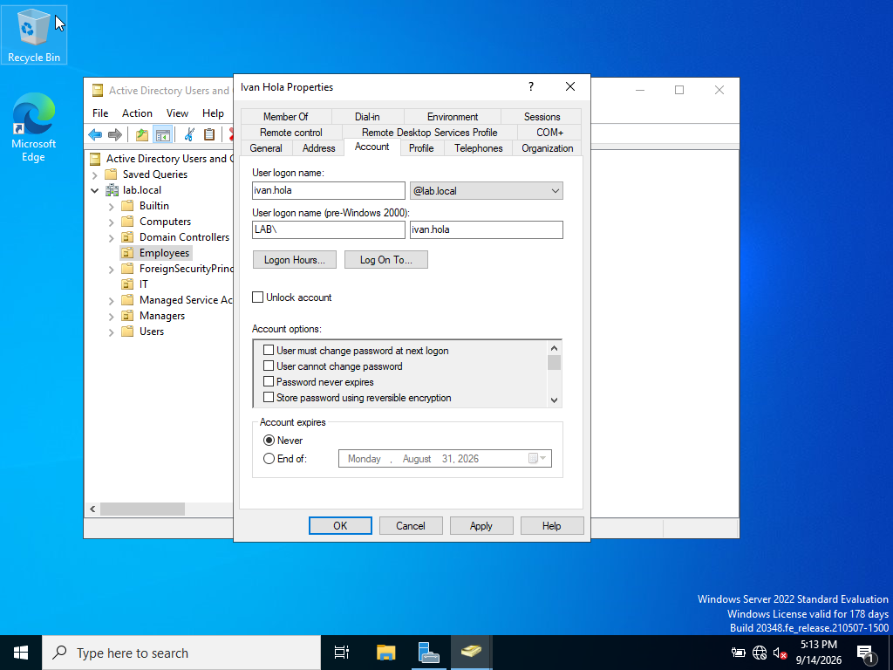

Yep — the Account tab showed an expiration date in the past. Flipped it back to "Never,"
had Ivan try logging in again:

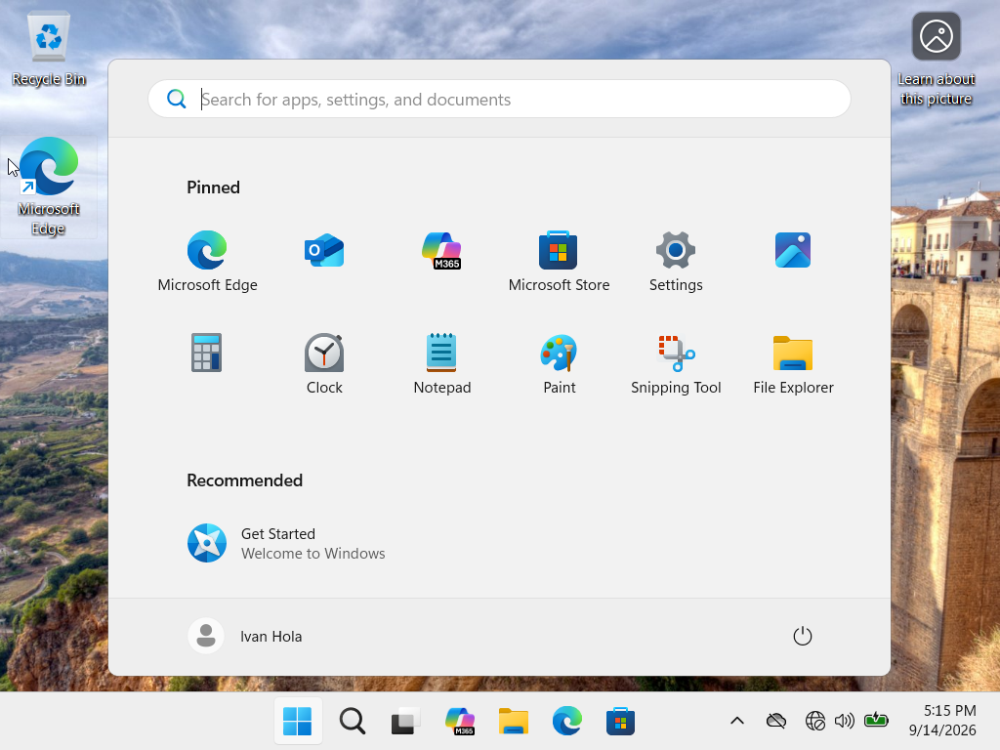

**Root cause:** account expiration date set in the past.
**Fix:** ADUC → user properties → Account tab → Account expires → Never.

Nothing complicated here, but it's a good reminder that not every login problem is a
password problem.

---

## Ticket 2 — "Something's weird with the network"

**Reported by:** Ivan Hola again (busy guy)

Vaguer ticket this time — "can't reach some internal stuff." Started with the basics:

```
ping 192.168.10.1
```

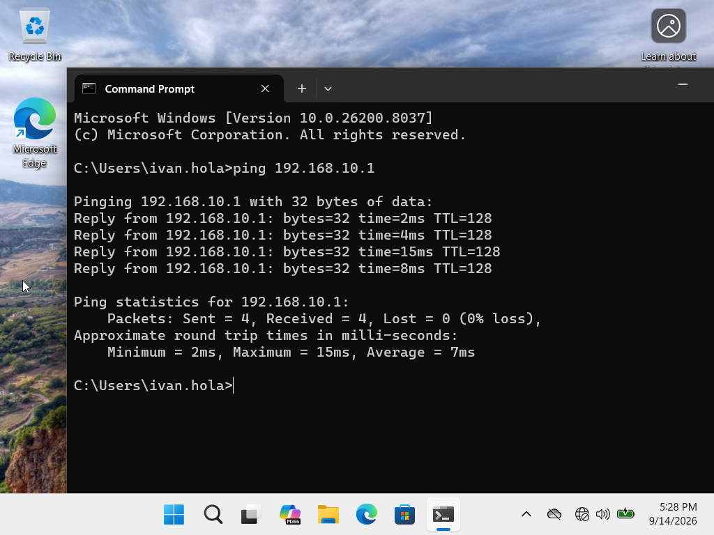

That worked fine, 0% loss. So the machines can actually talk to each other. Then I tried
pinging by name instead of IP, since that's usually the next thing to check:

```
ping dc01.lab.local
```

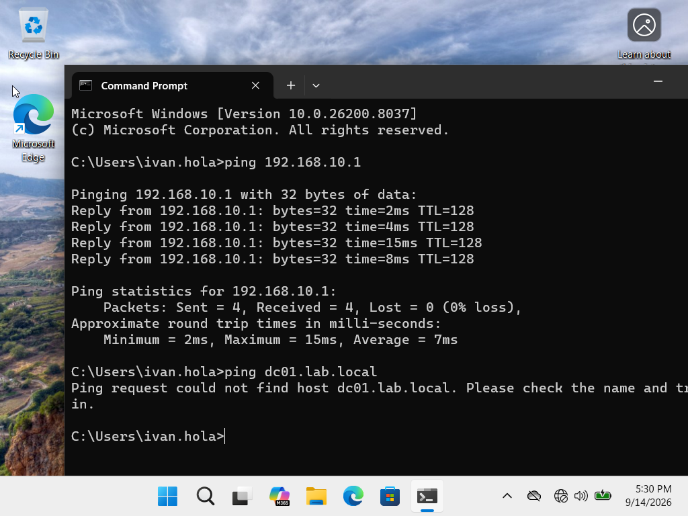

`Ping request could not find host dc01.lab.local.` That's the pattern you want to
remember — IP works, name doesn't, so it's almost always DNS. Ran `ipconfig /all` to
check what DNS server the client was even pointed at:

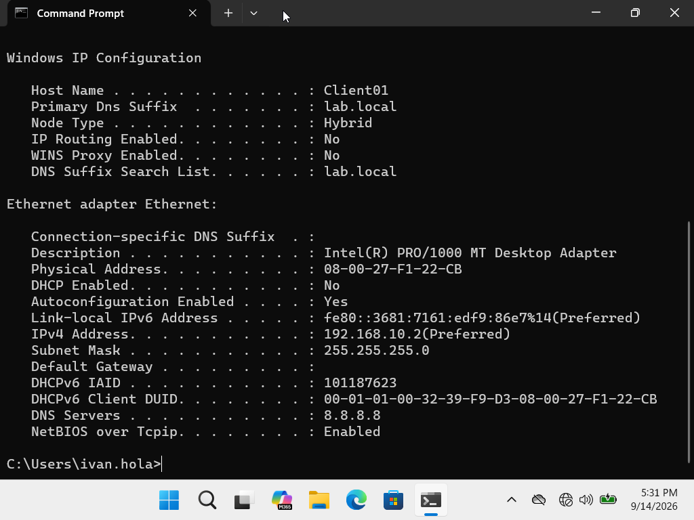

There it is — `DNS Servers: 8.8.8.8`. That's Google's public DNS, which is fine for
regular internet browsing but has no idea what `lab.local` is, since it's a private
internal domain. Set it back to the DC (192.168.10.1), ran `ipconfig /flushdns` to clear
out the old failed lookup, and tried again:

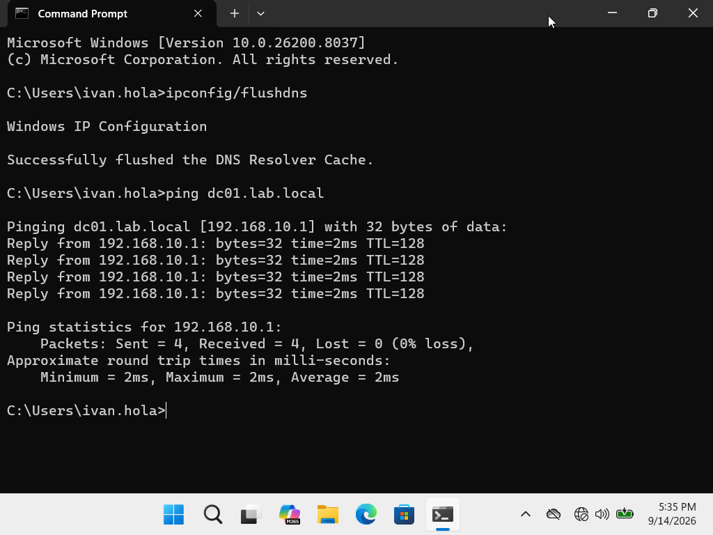

**Root cause:** client's preferred DNS server was pointed at a public DNS instead of the
domain controller.
**Fix:** corrected the DNS server setting, flushed the DNS cache.

This is the one I'd actually expect to see a lot in a real job — someone's VPN client or
some software quietly overwrites DNS settings and nobody notices until internal stuff
stops resolving.

---

## Ticket 3 — "Why is my Control Panel locked, I'm IT"

**Reported by:** Ron Delon (IT)

This one was more interesting because it's not really a "broken" problem — everything
was technically working, just applying somewhere it shouldn't. I already had a GPO
blocking Control Panel access for the Employees OU (built that as part of the AD lab).
Ron's in the IT OU, completely separate, so this shouldn't have touched him at all.

Reproduced it first:

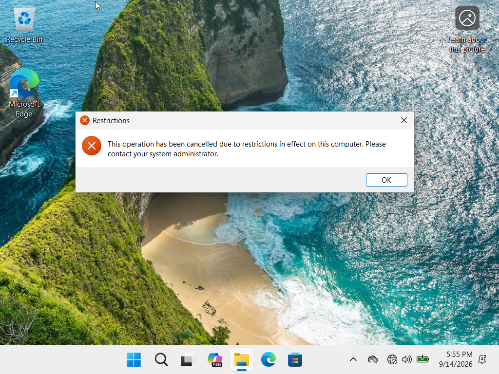

Same "restrictions in effect" message the Employees group gets. So logged in as Ron and
ran:

```
gpresult /r
```

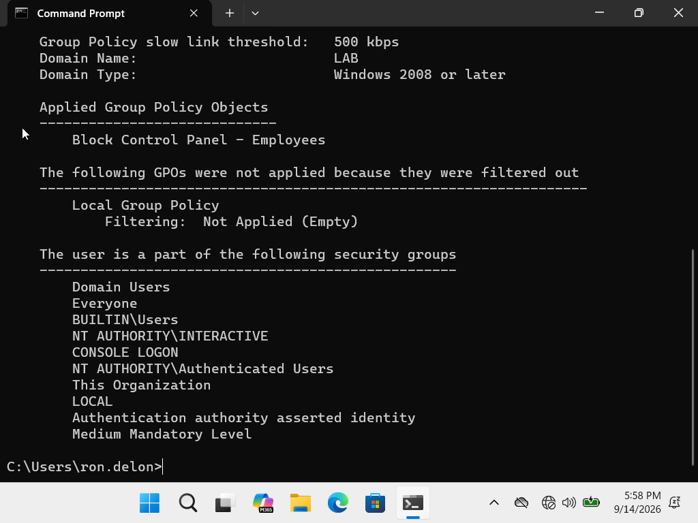

Under Applied Group Policy Objects — there it was, "Block Control Panel - Employees,"
showing up for a user who isn't even in that OU. That told me the policy itself was fine,
but it was linked somewhere too broad. Went into Group Policy Management and checked the
Scope tab on that GPO:

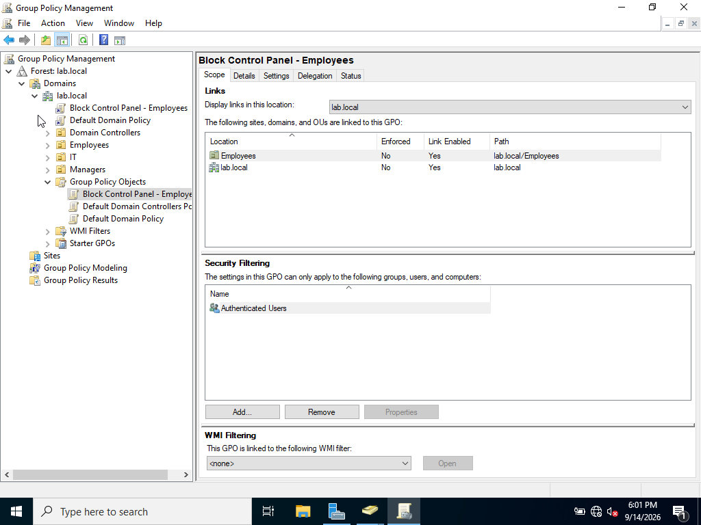

Two links: one on the Employees OU (correct, that's supposed to be there), and one
directly on the `lab.local` domain root. That second one is the problem — GPOs linked at
the domain level apply to every OU underneath, including IT. Somebody (me, pretending to
be a coworker who made a mistake) must have linked it there instead of just to Employees.

Deleted only the domain-level link — important that this doesn't delete the actual GPO or
its correct link to Employees, just removes that one bad connection:

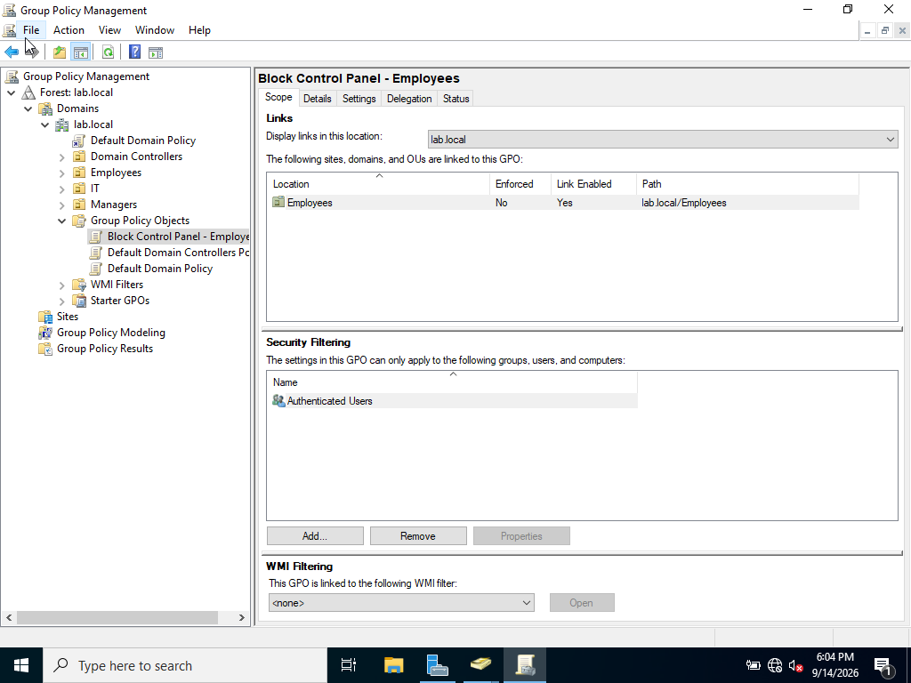

Ran `gpupdate /force` on the client, logged in as Ron again:

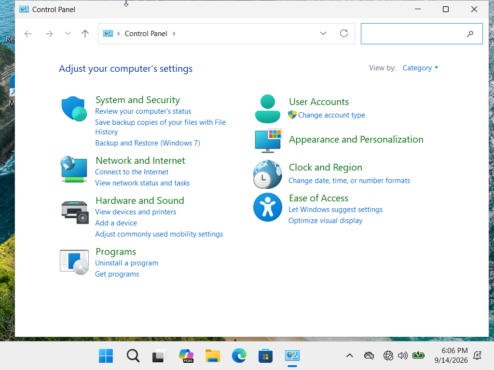

Full Control Panel access back for Ron. Double-checked that Ivan (Employees) was still
blocked, since the point was to fix where it applies, not to remove it entirely.

**Root cause:** the GPO was linked both to the Employees OU (intended) and to the domain
root (mistake), so it applied to every OU in the domain instead of just the one it was
meant for.
**Fix:** removed the domain-level GPO link, kept the Employees OU link.

Out of the three, this was the one where I actually had to think for a second instead of
just following an obvious error message. GPO inheritance is one of those things that
makes total sense once you've actually seen it go wrong once.

---

## A few things I took away from this

- Read the actual error text before doing anything else. Ticket 1 basically solved
  itself because I didn't skip past the message.
- "IP works, name doesn't" is a pattern worth just memorizing — saves time jumping
  straight to DNS instead of poking around randomly.
- GPOs inherit down the OU tree, so where you link something matters as much as what's
  inside it. `gpresult /r` is the tool for figuring out what's actually being applied and
  from where, instead of guessing.

Environment: Windows Server 2022 (DC01) + Windows 11 Pro (Client01), VirtualBox, domain
`lab.local`. Full build process is in the [active-directory-lab](../active-directory-lab)
folder.
